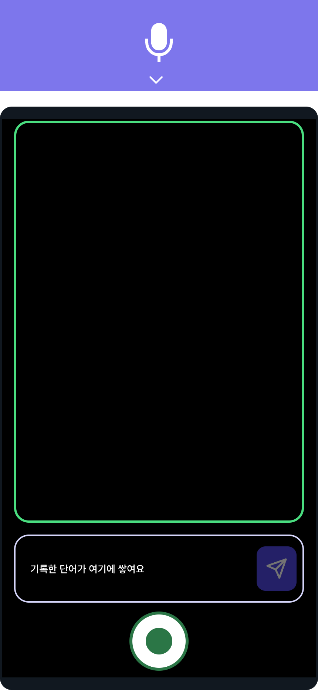
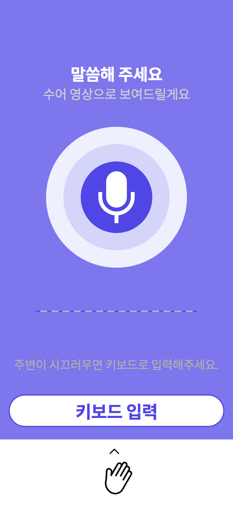
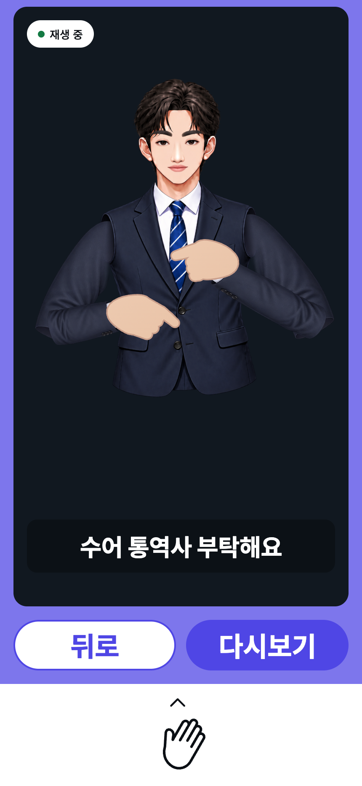

# Ear Dream Core

FastAPI + React Native 기반의 한손 수어 인식 실시간 통역 서비스

기존 수어 인식 서비스는 대부분 양손 수어를 전제로 하며, 휴대폰을 거치할 수 있는 환경에서만
제대로 동작합니다. 이 프로젝트는 이동 중처럼 한 손만 자유로운 상황에서의 수어 소통을 다룹니다.

- 농인 → 청인: 수어 동작을 단어 단위로 인식 → 1순위 후보로 자동 확정해 단어 누적
  (오인식은 단어를 탭해 후보 교체·삭제) → 문장 변환 → 텍스트 전달
- 청인 → 농인: 음성 인식(STT) → 문장을 어휘 단어로 분해 → 단어별 수어 동작을
  아바타로 재생

실제 화면입니다. 왼쪽 둘이 농인 → 청인, 오른쪽 둘이 청인 → 농인 방향입니다.

<table>
<tr>
<td width="25%" align="center"></td>
<td width="25%" align="center"></td>
<td width="25%" align="center"></td>
<td width="25%" align="center"></td>
</tr>
<tr>
<td valign="top"><b>진입 선택</b><br>어느 쪽이 말할 차례인지 고릅니다. 위는 음성, 아래는 수어입니다.</td>
<td valign="top"><b>수어 입력</b><br>가이드 박스에 얼굴과 양어깨를 맞추고, 버튼을 <b>누르고 있는 동안</b> 한 단어를 기록합니다. 인식된 단어는 아래 띠에 쌓이고, 잘못 나온 단어는 탭해서 바꿉니다. <i>(카메라를 연결하지 않고 찍어 뷰파인더가 검게 나왔습니다)</i></td>
<td valign="top"><b>음성 입력</b><br>청인이 말하면 받아쓰고, 주변이 시끄러우면 키보드로 넣습니다.</td>
<td valign="top"><b>아바타 재생</b><br>받은 문장을 어휘 단어로 쪼개 동작을 차례로 보여 줍니다. 자막은 원래 문장입니다.</td>
</tr>
</table>

> 설계와 파이프라인은 [아키텍처 문서](docs/architecture.md)에 있습니다.

## 빠른 시작

**요구사항** — Node.js 20+, Python 3.12+, pnpm, uv, 그리고 크롬 계열 브라우저.
카메라와 수어 인식이 브라우저 위에서 돌고 개발·측정이 전부 크롬 기준이라, 다른 브라우저는
확인되지 않았습니다(사파리는 음성 인식이 빠집니다).

```bash
brew install node pnpm uv                       # macOS
```

```powershell
winget install OpenJS.NodeJS                    # Windows
winget install astral-sh.uv
npm install -g pnpm
```

**설치** — 클론 직후 두 번이면 끝납니다.

```bash
pnpm install
pnpm setup
```

`pnpm setup`은 커밋하지 않는 산출물 셋을 만듭니다 — 파이썬 의존성(`uv sync`),
API 타입, 수어 인식 모델 번들. 처음 한 번은 1.5GB 남짓을 받으므로 시간이 걸립니다.

**실행** — 터미널 두 개.

```bash
pnpm dev:api    # API 서버 — http://localhost:8000
```

```bash
pnpm dev:web    # 앱 — 브라우저가 자동으로 열립니다
```

첫 실행 시 MediaPipe WASM·모델(약 50MB)을 자동으로 받습니다. 수어 입력 화면에서
카메라 권한을 허용하면 준비가 끝납니다. API 문서는 http://localhost:8000/docs 에 있습니다.

인식 모델은 API 서버에 in-process로 로드되므로 별도 프로세스가 없습니다. 문장 변환 LLM과
음성 합성은 GPU 서버가 필요한 [선택 기능](docs/optional-services.md)이고, 없어도
규칙 폴백과 브라우저 음성으로 전 구간이 돌아갑니다.

폰에서 카메라까지 확인하려면 [개발 가이드](docs/development.md)의 「실기기(모바일 웹)」를
참고하세요.

> **모델 번들이 없어도 서버는 뜹니다.** `POST /api/v1/recognize`만 503이 되고
> `GET /health`의 `model_loaded`가 `false`가 됩니다 — 문장 변환·아바타·음성은 그대로
> 동작합니다. 다시 받으려면 `pnpm setup:model-bundle`.

## 처음 써 보는 사람에게

수어를 모르는 사람도 앱만으로 양방향을 다 확인할 수 있습니다.

- **인식하는 단어는 300개뿐입니다.** 목록은 서버를 띄운 뒤
  http://localhost:8000/api/v1/vocabulary 에서 볼 수 있습니다.
- **동작을 모르면 아바타에게 먼저 물어보세요.** 음성 화면에서 단어를 말하거나 키보드로
  입력하면 아바타가 그 수어 동작을 재생합니다. 그대로 따라 하면 인식 쪽도 시험할 수 있습니다.
- 수어 화면에서는 **아래쪽 큰 버튼을 누르고 있는 동안** 한 단어를 기록하고, 떼면 전송됩니다.
  얼굴과 양어깨가 화면에 들어와야 합니다 — 어깨가 좌표 정규화의 기준입니다.
- **한 번에 안 맞는 것이 이상한 상태는 아닙니다.** 처음 보는 사람의 손을 맞히는 비율은 아직
  절반 남짓입니다. 틀린 단어는 탭해서 다른 후보로 바꾸거나 지우면 됩니다. 측정값과 그 한계는
  [아키텍처 문서](docs/architecture.md)에 있습니다.

## 구성

```
packages/
  core/            // 공유 API 계약 (OpenAPI에서 생성한 TS 타입)
  ear-dream-api/   // FastAPI 서버 — 수어 단어 인식 추론, 문장 변환
  ear-dream-app/   // Expo, React Native 앱
  android-shell/   // 웹 번들을 APK로 감싸는 WebView 셸
```

수어 인식 모델의 학습·실험 코드는 별도 레포에 있고, 이 레포의 서버는 그 학습
산출물(모델 번들)을 읽어 서빙만 합니다.

## 명령어

| 명령어 | 설명 |
| --- | --- |
| `pnpm setup` | 클론 직후 1회 — uv sync + API 타입 + 모델 번들 |
| `pnpm dev:api` | API 서버 |
| `pnpm dev:web` | 앱 (브라우저) |
| `pnpm dev:app` | 앱 (QR / 시뮬레이터 / 에뮬레이터) |
| `pnpm build:web-mobile` | 실기기용 웹 내보내기 (API를 상대경로로, gzip 사이드카 포함) |
| `pnpm serve:mobile` | 웹 + API 단일 오리진 서버 (8080 평문 — https는 터널이 담당) |
| `pnpm build:apk` | 위 웹 내보내기를 WebView 셸에 담아 APK 빌드 (JDK 17~21 + Android SDK 필요) |
| `pnpm typecheck` | TypeScript 타입 검사 |
| `pnpm test:api` | API 테스트 |
| `pnpm lint:api` | API 린트 |
| `pnpm generate:api-types` | API 타입 재생성 (스키마·라우트 변경 후) |
| `pnpm setup:model-bundle` | 모델 번들 다시 받기 (`--force`로 재설치) |

MediaPipe 애셋·폰트 서브셋·gzip 사이드카는 위 명령들이 알아서 만듭니다. 아바타 시퀀스를
원본 영상에서 다시 뽑는 일은 드물어서 스크립트를 직접 부릅니다 —
`cd packages/ear-dream-api && uv run python scripts/build_sign_sequences.py`.

## 문서

| 문서 | 내용 |
| --- | --- |
| [아키텍처](docs/architecture.md) | 양방향 파이프라인, 인식 모델(Single-Observed-Hand), 라이브 도메인 보정, 알려진 한계 |
| [개발 가이드](docs/development.md) | 실기기(모바일 웹), 앱 실행 대상, API 주소 설정, API 타입 생성, 모델 번들 배포 |
| [선택 기능](docs/optional-services.md) | 문장 변환 LLM · 음성 합성 서버 설정 |
| [Android 셸](packages/android-shell/README.md) | APK 빌드, WebView에서 잃는 기능, 서버 주소 설정 |

## 현재 상태

| 엔드포인트 | 상태 |
| --- | --- |
| `GET /health` | 동작 — `status`, `model_loaded`, `vocab_size` |
| `POST /api/v1/recognize` | 동작 — 랜드마크 세그먼트 → 단어 후보 top-k |
| `POST /api/v1/compose-sentence` | 동작 — 단어 열 → 문장 (LLM, 실패 시 규칙 폴백) |
| `POST /api/v1/speech` | 동작 — 문장+태그 → WAV. 서버 미가동 시 503(앱이 브라우저 음성으로 폴백) |
| `POST /api/v1/sign-sequence` | 동작 — 문장 → 아바타가 재생할 단어 열. 문장 분해는 템플릿 역인덱스 + 형태소 분석(kiwipiepy), 변환 모델은 미착수 |
| `GET /api/v1/vocabulary` | 동작 — 어휘 300단어 카탈로그 |
| `GET /api/v1/model` | 동작 — 모델·전처리·계약 정보 |
| `GET /api/v1/phrases` | 스키마만 확정, 빈 배열 반환 |

## 로드맵

기술 리스크가 큰 인식 부분을 먼저 검증하는 순서로 진행했습니다.

| 단계 | 내용 | 상태 |
| --- | --- | --- |
| M0 | 카메라 + 손·얼굴·포즈 랜드마크 추출 | 완료 (웹) |
| M1 | 제한 어휘 인식, 후보 top-N (30단어 → 현재 300단어로 확장) | 완료 |
| M2 | 후보 확정, 단어 누적 → 문장 변환, 텍스트 표시 | 완료 |
| M3 | 오인식 정정, 상황 문장 호출 | 부분 — 정정(후보 교체·삭제·재전송)은 됨, 상황 문장 미착수 |
| M4 | 음성 → 수어 영상 | 부분 — STT·문장 분해·아바타 재생은 됨. 어휘 **300단어 전부** 동작 시퀀스 보유. 조음 정확성 육안 검증 전 |
| M5 | WebRTC 양방향 세션 | 미착수 |

다음 단계로 확정된 것은 단어당 버튼 캡처를 발화 단위 촬영 + 서버 오프라인 분절(손 keypoint
정지 구간 기준)로 전환하는 것입니다. 아직 구현 전입니다.

인식 정확도, 허용 지연 시간, 후보 개수는 아직 확정되지 않았습니다. 라벨된 실사용 클립
138개로 잰 수치는 [아키텍처 문서](docs/architecture.md)에 있지만, 그 셋이 적응 학습에
쓰인 사람의 다른 촬영 회차라 목표치의 근거로는 쓰지 않습니다. 학습 데이터셋(통제 환경)
기준 수치도 실사용 정확도와 다르므로 마찬가지입니다.
