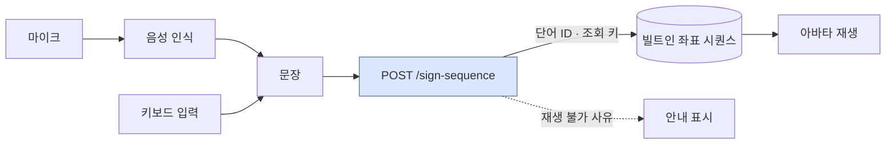
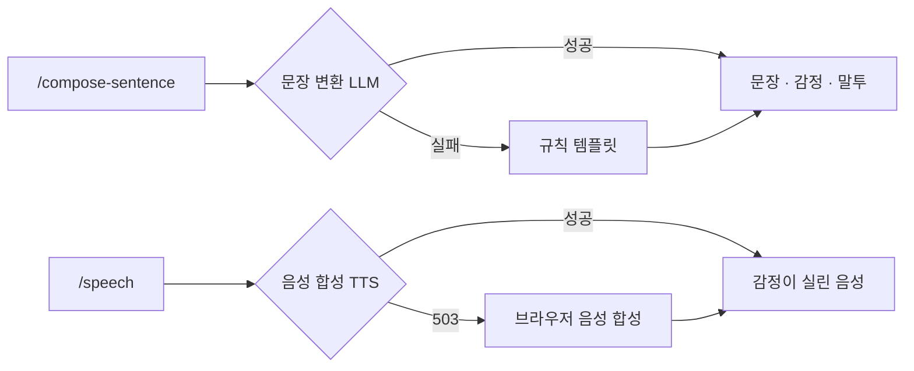
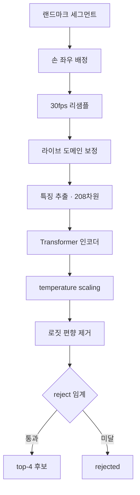
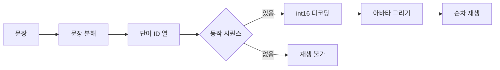

# 아키텍처

양방향 통역이라 파이프라인이 둘이다. 노란 영역은 **앱(브라우저)**, 파란 영역은
**API 서버**에서 돈다.


## 농인 → 청인 (수어를 말로)


> 파란 상자가 **API 서버**, 나머지는 **앱(브라우저)**에서 돈다.


버튼을 누르는 동안 한 단어를 캡처해 보내고, 응답의 1순위 후보가 pill로 쌓인다.
pill을 탭하면 후보를 교체하거나 지울 수 있다. 세그먼트는 얼굴 메쉬까지 포함해
수 MB라 gzip으로 보낸다.

## 청인 → 농인 (말을 수어로)




**좌표는 응답에 싣지 않는다.** 앱에 함께 빌드되어 있고 서버는 재생 순서와 조회 키만
준다 — 아바타 재생이 서버 왕복 없이 끝난다. 재생 불가는 두 종류로 나뉜다:
어휘에 없는 단어(`unknown_word`)와 어휘엔 있으나 동작 시퀀스가 없는 단어(`no_sequence`).

## 외부 의존과 폴백

무거운 생성 모델 둘은 별도 GPU 서버에서 돈다. **없어도 서비스는 멈추지 않는다.**



그래서 노트북 한 대로도 전 구간이 시연된다.

## 수어 인식 모델 (SPOTER-208)

Transformer 인코더 분류기. 좌표는 **x·y만** 쓴다 — z는 추출기 세대 간 분포가 달라
신뢰할 수 없음이 실측으로 확인됐다.



208차원은 포즈 25점(global 정규화) + 손 21×2(local) + 얼굴 37점(local)의 x·y다.
손은 위치·크기를 제거해 **모양만** 남기고, 위치와 움직임은 포즈가 담당한다.

### 모델 아키텍처

**SPOTER-208** — 수어 인식용 Transformer 인코더 분류기. 어휘 300단어(AI Hub 일상
고빈도 핵심단어), TorchScript로 서빙한다.

- 입력: 프레임당 **208차원 특징 × 최대 256프레임**. 좌표는 **x·y만 쓴다**
  (z는 추출기 세대 간 분포가 달라 신뢰할 수 없음이 실측으로 확인돼 제외)
- 208차원 구성 (전처리 계약 `spoter2_mp_xy_v1`):
  - pose 25점×2 — 어깨 중점 원점, 어깨거리 스케일의 global 정규화 (위치·움직임 담당)
  - 오른손·왼손 각 21점×2 — square bbox → [-1,1] local 정규화 (손 모양만 담당,
    위치·크기 제거)
  - 얼굴 37점×2 — 478점 메쉬(홍채 포함)에서 서브셋 선택, local 정규화 (비수지신호)
- 출력: 300클래스 확률. temperature scaling(번들 값) 후 임계 미달이면 `rejected`

### 서빙 파이프라인 (요청 → 후보)

```
raw 아카이빙 → 손 좌우 배정(포즈 손목 기하 매칭) → 30fps 최근접 리샘플
→ 라이브 도메인 보정(아래) → 정규화·특징 추출 [T,208] → TorchScript 추론
→ temperature → 로짓 편향 제거 → reject 임계 → top-4 후보
```

### 적용된 라이브 도메인 보정

학습 데이터(스튜디오 16:9 촬영)와 실사용 입력(휴대폰 셀피 세로)의 분포 차이를
서빙 입력을 학습 분포 쪽으로 사영해 좁힌다. 실측 근거와 함께 도입됐고, 수치는
전부 **재학습·재캘리브레이션 전까지의 임시값**이다 (`app/core/config.py` 주석 참조).

| 보정 | 내용 | 근거 |
| --- | --- | --- |
| 종횡비(AR) 보정 | `x ← x × AR입력/(16/9)` — 세로 캡처 좌표를 16:9 학습 관례로 사영 | 세로 왜곡만으로 top-1 98→62% 붕괴 실측 |
| y축 기하 보정 | `y ← y × 1.205` — 셀피 근접 원근으로 몸통 비례가 눌리는 갭 보정 | 어깨-엉덩이 비율 스튜디오/라이브 실측 차 |
| 로짓 편향 제거 | log-softmax에서 편향 벡터(α=1.0) 차감 — 도메인 이동이 만든 특정 단어 과호출 억제 | 라벨 없는 실사용 아카이브로 추정 |
| reject 임계 0.15 | 라이브 conf 분포 기준 임시 하향 (스튜디오 기준 0.5는 라이브 정답도 전량 거부) | 라벨된 라이브 클립 임계 곡선 |

이 밖에 검토 후 **기각된** 접근(추출기 통일, 결측 보간, 미러링, 스무딩, TTA 등)과
그 근거는 모델 레포의 가설 원장 문서에 기록돼 있다.

### 알려진 구조적 한계

- **한손 재조음 갭**: 어휘 300단어 중 194단어가 학습 데이터에서 양손 조음이다.
  한 손만 보이는 입력(다른 손이 폰을 쥔 상황)은 학습에 없는 분포라 해당 단어의
  인식이 급락한다 — 한손 뷰 증강 재학습으로 대응 예정
- **깊이축 동작 단어**: 몸 쪽으로 당기는 동작처럼 움직임이 카메라 축 방향인 단어는
  x·y 투영에 신호가 거의 남지 않는다 — 손 크기(bbox scale) 피처 추가가 후속 후보
- 위 정확도 관련 수치는 소규모 진단 실측이므로 목표치·기대치로 인용하지 않는다
## 문장 변환 (2단계 LLM)

같은 모델을 두 번 호출한다. 감정·말투는 원본 단어가 아니라 **완성된 문장**을 보고
분류한다 — "기쁘지 않아요"를 happy로 잘못 읽지 않기 위해서다.


## 아바타 재생

문장을 단어로 쪼개는 모델은 아직 없다. 지금은 규칙 템플릿을 역방향으로 쓰는 mock이고,
진짜 모델이 붙으면 이것이 폴백으로 남는다.



손·상체는 선으로, 얼굴 78점은 점으로 그린다. 단어 사이에는 짧은 보간을 넣어
자세가 튀지 않게 한다.

