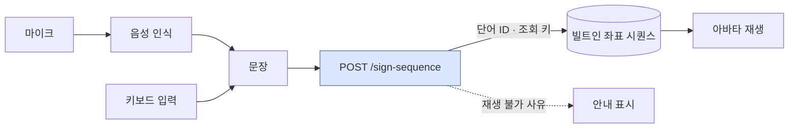
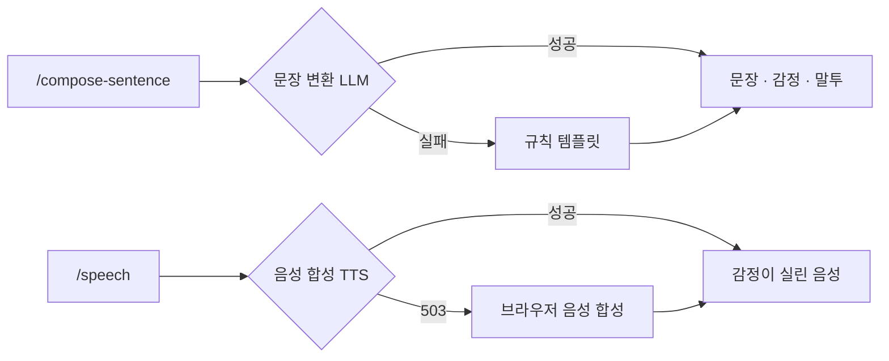
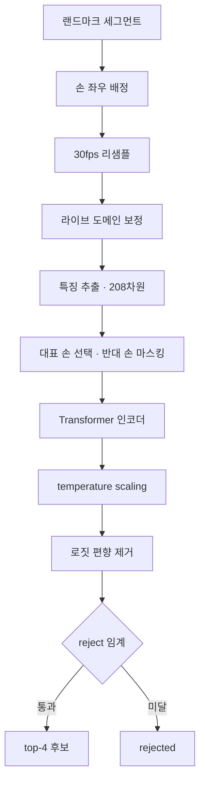
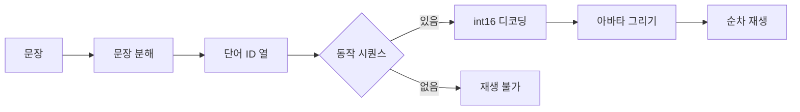

# 아키텍처

양방향 통역이라 파이프라인이 둘입니다. 노란 영역은 **앱(브라우저)**, 파란 영역은
**API 서버**에서 돕니다.


## 농인 → 청인 (수어를 말로)


> 파란 상자가 **API 서버**, 나머지는 **앱(브라우저)**에서 돕니다.


버튼을 누르는 동안 한 단어를 캡처해 보내고, 응답의 1순위 후보가 pill로 쌓입니다.
pill을 탭하면 후보를 교체하거나 지울 수 있습니다. 세그먼트는 얼굴 메쉬까지 포함해
수 MB라 gzip으로 보냅니다.

## 청인 → 농인 (말을 수어로)




**좌표는 응답에 싣지 않습니다.** 앱에 함께 빌드되어 있고 서버는 재생 순서와 조회 키만
줍니다 — 아바타 재생이 서버 왕복 없이 끝납니다. 재생 불가는 두 종류로 나뉩니다:
어휘에 없는 단어(`unknown_word`)와 어휘엔 있으나 동작 시퀀스가 없는 단어(`no_sequence`).

## 외부 의존과 폴백

무거운 생성 모델 둘은 별도 GPU 서버에서 돕니다. **없어도 서비스는 멈추지 않습니다.**



그래서 노트북 한 대로도 전 구간을 시연할 수 있습니다.

## 수어 인식 모델 (Single-Observed-Hand)

Transformer 인코더 분류기입니다. 좌표는 **x·y만** 씁니다 — z는 추출기 세대 간 분포가
달라 신뢰할 수 없음이 실측으로 확인됐습니다.



208차원은 포즈 25점(global 정규화) + 손 21×2(local) + 얼굴 37점(local)의 x·y입니다.
손은 위치·크기를 제거해 **모양만** 남기고, 위치와 움직임은 포즈가 담당합니다.

### 모델 아키텍처

**Single-Observed-Hand 300** — 수어 인식용 Transformer 인코더 분류기입니다. 어휘 300단어
(AI Hub 일상 고빈도 핵심단어)를 TorchScript로 서빙합니다. 208차원 입력 계약과 300 클래스
인덱스는 이전 세대들과 같고, 바뀐 것은 **손을 하나만 본다**는 점입니다.

학습 데이터의 양손 단어도 대표 손 하나만 남기고 반대 손을 지운 채 학습했습니다. 그래서
서빙도 같은 형태로 넣습니다 — 한 손으로 폰을 든 실사용 자세가 학습 분포 안에 들어옵니다.
추론 전에 그 단어가 한손 수어인지 양손 수어인지 알 필요가 없습니다.

여기에 실제 촬영 데이터로 **도메인 적응**을 얹었습니다. 배경·카메라·조명·사용자 차이를
줄이려고 직접 촬영분 CE에 AI Hub 혼합과 teacher distillation을 함께 걸었습니다.

- 입력: 프레임당 **208차원 특징 × 최대 256프레임** + 프레임별 **손 검출 마스크**.
  좌표는 **x·y만 씁니다**
  (z는 추출기 세대 간 분포가 달라 신뢰할 수 없음이 실측으로 확인돼 제외했습니다)
- **대표 손 선택**: 검출률이 0.15 이상 차이 나면 많이 보인 손, 비슷하면 상하위 10%를
  잘라낸 이동량 중앙값이 큰 손을 고릅니다. 선택되지 않은 손의 42차원은 0으로 지웁니다.
  ⚠️ 이 규칙은 학습 쪽과 **수치가 일치해야 합니다** — 선택이 갈리면 모델이 보는 손이
  달라집니다. 서버 구현과 학습 레퍼런스를 대조하는 테스트가 있습니다
- 208차원 구성 (전처리 계약 `spoter2_mp_xy_v1`):
  - pose 25점×2 — 어깨 중점 원점, 어깨거리 스케일의 global 정규화 (위치·움직임 담당)
  - 오른손·왼손 각 21점×2 — square bbox → [-1,1] local 정규화 (손 모양만 담당,
    위치·크기 제거)
  - 얼굴 37점×2 — 478점 메쉬(홍채 포함)에서 서브셋 선택, local 정규화 (비수지신호)
- 손 검출 마스크: 프레임별 오른손·왼손 검출 여부입니다. 0을 좌표로 오해하지 않게 하는
  게이팅입니다
- 출력: 서빙이 쓰는 것은 **300클래스 확률 하나**입니다. 한손/양손 이진 분류기와 retrieval
  임베딩이 함께 있지만 확정 분류에는 쓰지 않습니다 — 학습 레포가 한손/양손 hard routing을
  두지 않기로 결론냈습니다
- temperature scaling(번들 값) 후 임계에 미달하면 `rejected`입니다

### 서빙 파이프라인 (요청 → 후보)

```
raw 아카이빙 → 손 좌우 배정(포즈 손목 기하 매칭) → 30fps 최근접 리샘플
→ 라이브 도메인 보정(아래) → 정규화·특징 추출 [T,208] → TorchScript 추론
→ temperature → 로짓 편향 제거 → reject 임계 → top-4 후보
```

### 적용된 라이브 도메인 보정

MediaPipe 정규화 좌표는 프레임 종횡비에 따라 이방성이 달라지므로, **"어떤 종횡비의
정규화 좌표인가"가 모델 입력 계약의 일부**입니다. 서빙은 입력을 모델이 기대하는 관례로
사영합니다.

| 보정 | 내용 | 상태 |
| --- | --- | --- |
| 종횡비(AR) 보정 | `x ← x × AR입력/AR_TRAIN` | **켜짐** — 현재 모델은 `AR_TRAIN = 9/16`이라 세로 캡처에는 항등 |
| y축 기하 보정 | `y ← y × 1.205` | 켜짐 — 임시값 |
| 로짓 편향 제거 | log-softmax에서 편향 벡터 차감 | **꺼짐** (α=0) |
| reject 임계 | 최고 confidence 미달이면 `rejected` | **꺼짐** (임계 0 = 거부 없음) |

⚠️ **`AR_TRAIN`은 모델마다 다릅니다.** 스튜디오 16:9만으로 학습한 모델은 16/9였지만, 현재
모델은 폰 세로 촬영본으로 도메인 적응을 해서 **세로 좌표를 그대로 기대합니다**. 값이
어긋나면 에러 없이 정확도만 무너집니다 — 실측으로 맞을 때 39.9%, 어긋날 때 29.0%였고,
반대로 같은 조작을 스튜디오 전용 모델에 걸면 23.2% → 7.2%로 붕괴합니다. 즉 이 값은
취향이 아니라 **모델의 학습 좌표 관례**입니다.

⚠️ 뒤의 두 줄이 꺼진 이유는 둘 다 추정에 쓴 모델의 출력 분포에 묶인 값이기 때문입니다.
편향 벡터를 다른 가중치에 쓰면 보정이 아니라 새 편향 주입이 되고, 현재 번들에는
캘리브레이션 산출물이 없습니다. 근거 없는 값을 남겨 두는 대신 꺼서 서빙합니다.

라벨된 라이브 셋이 생긴 뒤로는 임계를 **잴 수 있습니다** — 다만 그 셋 하나로 임계를
고르고 같은 셋으로 성능을 보고하면 순환이라, 값을 박기 전에 별도 촬영분이 필요합니다.
측정된 곡선은 「라이브 실측」 절에 있습니다.

### 라이브 실측

라벨된 실사용 클립 138개(폰 세로 촬영)로 잰 값입니다.
스튜디오 수치와 혼동하지 마세요 — 같은 모델이 AI Hub test에서는 90% 안팎입니다.

⚠️ **이 138클립은 현재 모델에게 "처음 보는 사람"이 아닙니다.** 이 사람의 다른 촬영 회차가
적응 학습에 들어가 있어서, 71.0%는 **등록된 사용자** 수치입니다. 처음 보는 사람 기대치는
학습 레포의 4-fold LOPO 평균 **54.19%**를 써야 합니다. 아래 표의 나머지 줄은 이 사람을
본 적 없는 이전 세대 모델 기준이라, 서로 다른 조건의 값이 한 표에 섞여 있습니다.

| 조건 | top-1 | top-4 |
| --- | ---: | ---: |
| **현재 서빙 (v2 · 등록된 사용자)** | **71.0%** | **93.5%** |
| 이전 세대 3인 모델 (미지 사용자) | 39.9% | 69.6% |
| 이전 세대에서 AR_TRAIN 을 16/9 로 두면 | 29.0% | 54.3% |
| 얼굴 특징 제거 | 23.9% | 39.1% |
| 결측 손 채움 | 25.4% | 44.2% |

이 데이터의 왼손 검출률은 2.5%입니다 — 한 손으로 폰을 든 실제 자세이고, 현재 모델이
겨냥한 조건입니다. 얼굴은 빼면 크게 나빠지므로 기여가 크고, 결측 손 채움은 세 모델
세대에서 일관되게 유해했습니다.

시간축 스무딩(창 7)은 이전 세대에서 +2.1%p였지만 AR 관례를 맞춘 뒤 이득이 대부분
사라졌고, 현재 모델에서는 오히려 −0.7%p입니다 — flip TTA가 이미 앙상블 역할을 합니다.
손 검출률로 거르는 게이트도 같은 커버리지의 confidence 임계보다 약했습니다(31.4% vs 45.0%).

reject 임계를 올리면 통과분 정확도는 오르고 커버리지는 떨어집니다 — 임계 0.4에서
커버리지 58% · 통과분 45.0%입니다.

### 알려진 구조적 한계

- **한손 재조음 갭**: 어휘 300단어 중 대부분이 학습 데이터에서 양손 조음입니다.
  한 손만 보이는 입력(다른 손이 폰을 쥔 상황)이 학습에 없는 분포라는 것이 오랜
  병목이었습니다. 현재 모델이 **학습 자체를 한 손 입력으로** 돌려 이 지점을 정면으로
  다뤘고, 라벨된 라이브 셋에서 실제로 개선이 확인됐습니다(위 표). 다만 절대 정확도는
  여전히 낮습니다
- **신규 사용자 일반화**: 도메인 적응에 쓴 4명과 다른 사용자에서는 성능이 크게
  떨어집니다 (학습 레포 4-fold LOPO 평균 top-1 54.19%). 사용자별 등록 없이 쓰는 것이
  현재 조건입니다
- **깊이축 동작 단어**: 몸 쪽으로 당기는 동작처럼 움직임이 카메라 축 방향인 단어는
  x·y 투영에 신호가 거의 남지 않습니다 — 손 크기(bbox scale) 피처 추가가 후속 후보입니다
- 위 정확도 관련 수치는 소규모 진단 실측이므로 목표치·기대치로 인용하지 않습니다

## 문장 변환 (2단계 LLM)

같은 모델을 두 번 호출합니다. 감정·말투는 원본 단어가 아니라 **완성된 문장**을 보고
분류합니다 — "기쁘지 않아요"를 happy로 잘못 읽지 않기 위해서입니다.


## 아바타 재생

문장을 단어로 쪼개는 모델은 아직 없습니다. 지금은 규칙 템플릿을 역방향으로 쓰는 mock이고,
진짜 모델이 붙으면 이것이 폴백으로 남습니다.



손·상체는 선으로, 얼굴 78점은 점으로 그립니다. 단어 사이에는 짧은 보간을 넣어
자세가 튀지 않게 합니다.
